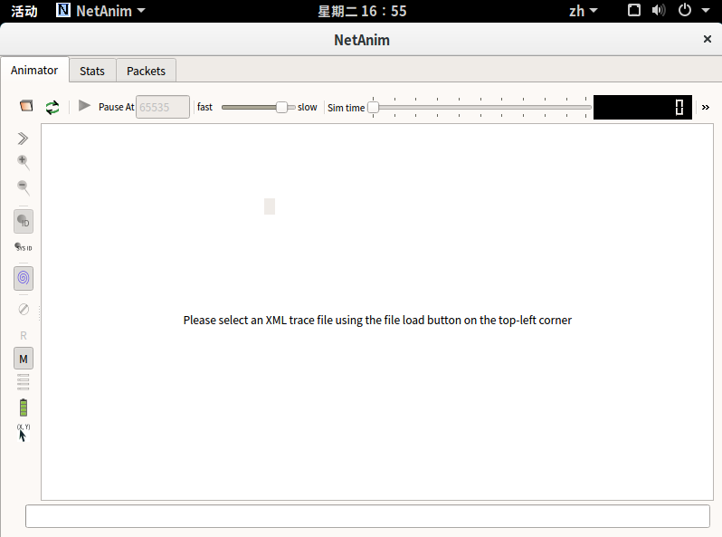
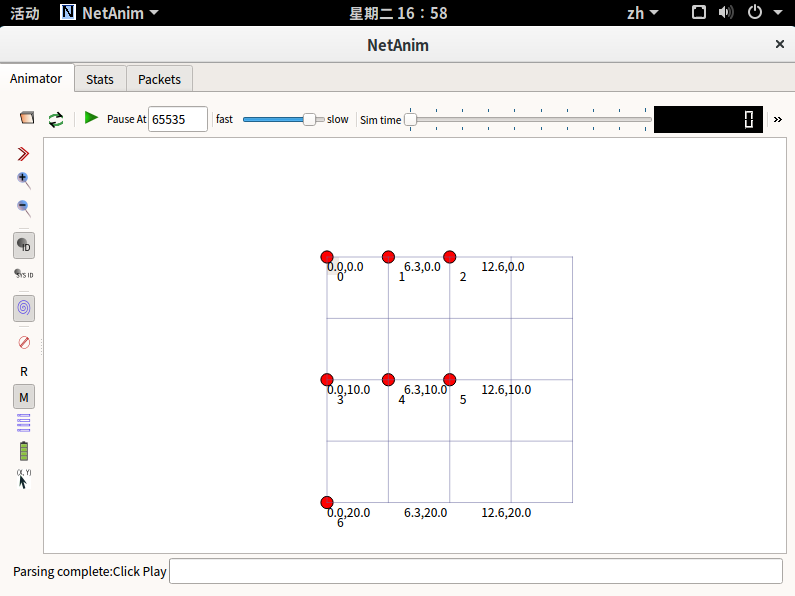
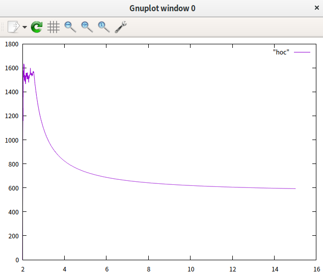

# 😀NS3实验
> NUAA 2018 网络通信实现技术 实验3
---

# ❓说明
通俗来说，`NS3`是一个运行在`Linux`系统上的网络模拟器，你可以通过写代码的方式来构造一些网络拓扑、离散事件，满足学术研究、测试的需要。

实验的内容是用代码分别模拟一个`WiFi`星形网络和`WiFi`多跳网络，并且使之可视化，最后求出吞吐量

# 💻NS3的安装
> 安装方法以`Ubuntu/Debian`系系统为例

[官方的教程](https://www.nsnam.org/docs/tutorial/html/getting-started.html#downloading-ns3)中给出了两种安装方法：
* Tarball
* Bake

这里推荐使用`Tarball`方法进行安装，简单粗暴，首先下载`NS3`的源码包，你可以根据需要更改版本号：
```
wget http://www.nsnam.org/release/ns-allinone-3.29.tar.bz2
```

解压之：
```
tar xjf ns-allinone-3.29.tar.bz2
```

解压之后会得到`NS3`的源码文件夹，里面有编译脚本、源码、实例、测试用例等，进入文件夹运行编译脚本进行编译即可：
```
cd ns-allinone-3.29
./build.py --enable-examples --enable-tests
```

**编译的时间将会十分漫长，一般如果你的Linux机器内存过小，编译时很难通过的，2G内存一般都不够用，如果失败了，请提高内存重试**

编译完成之后，可以看见目录下多了一个`ns3-3.29`文件夹，这边是`NS3`的主程序文件夹了，可以进去尝试使用：

```
./waf --run hello-simulator
```

来尝试运行`NS3`官方附带的简单示例程序，如果能看到正确编译的提示并且终端输出了`Hello Simulator`，这说明安装成功了

# 🏃运行
`NS3`的脚本运行有一些麻烦，首先你需要将`hoc.cc`和`star.cc`放到`NS3`主程序`waf`同目录的文件夹`scratch`下，这个目录是`NS3`默认的脚本存放目录

放过去之后，启动`waf`来进行编译:

```
./waf
```

如果没有问题的话应该会编译成功，编译成功之后可以使用`waf`来辅助运行，以`star.cc`为例，运行的方法如下：

```
./waf --run scratch/star
```

那么如何可视化呢，如果想要使代码可视化，需要先安装`NetAnim`，这是一个基于`Qt5`的`NS3`可视化程序，它的源码也一同附带在了`NS3`的源码包中，我们要做的就是使用`Qt5`编译它

首先需要安装`Qt5`和`Mercurial`：

```
sudo apt-get install mercurial
sudo apt-get install qt5-default
```

安装完成之后，进入`ns-allinone-3.29/netanim-3.108`目录，使用`Qt5`的编译器`qmake`进行编译:

```
cd ns-allinone-3.29/netanim-3.108
qmake ./NetAnim.pro
```

编译完成后，则可以打开`NetAnim`程序了：

```
./NetAnim
```

界面长这样：


在`NS3`的脚本运行后，在`waf`同级的目录下会生成对应的`xml`文件，使用`NetAnim`载入`xml`文件然后点击开始运行，即可看到可视化效果：



那么吞吐量怎么求呢，首先你需要安装`gnuplot`：

```
sudo apt-get install gnuplot
```

这是一个根据`NS3`脚本运行时产生的`trace`文件生成图标的软件，这里提供了一个用于求吞吐量的`awk`脚本，也就是`throughout.awk`

具体的使用方法是，将这个脚本放在`waf`同级的目录下，然后使用输入：

```
gawk -f throughout.awk xxx.tr > xxx
```

即可将数据存入`xxx`，其中`xxx.tr`是你的脚本在运行过程中生成的`.tr`文件，在`waf`同级目录下

最后使用`gnuplot`来画图，首先进入`gnuplot`的`shell`：

```
gnuplot
```

然后输入：

```
plot "xxx" with lines
```

即可看到效果：


